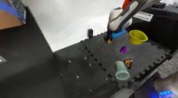
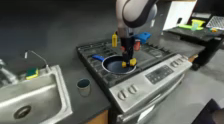
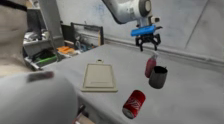
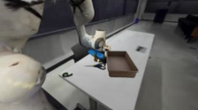

---

# PolaRiS

**[🌐 Website](https://polaris-evals.github.io/)** • **[📄 Paper](https://arxiv.org/abs/2512.16881)** • **[🤗 PolaRiS Hub](https://huggingface.co/datasets/owhan/PolaRiS-Hub)**


PolaRiS is a evaluation framework for generalist policies. It provides tooling for reconstructing environments, evaluating models, and running experiments with minimal setup.

## Installation

### Clone the repository (recursively)

```bash
git clone --recursive git@github.com:arhanjain/polaris.git
cd PolaRiS
```

If you cloned without `--recursive`:

```bash
git submodule update --init --recursive
```

### Setup environment with uv
If you don't have UV installed, see [installation instructions](https://docs.astral.sh/uv/getting-started/installation/)


By default we support CUDA 13. If you have an older version of CUDA installed, please downgrade the torch and torchvision version and index to be compatible in the [pyproject.toml](pyproject.toml).
```bash
uv sync 
```

## Getting Started
First, download the PolaRiS environments (<2GB)
```bash
uvx hf download owhan/PolaRiS-Hub --repo-type=dataset --local-dir ./PolaRiS-Hub
```

### Minimal Code Example
Next let's test a simple random action policy in a PolaRiS environment.
```python
import torch
import argparse
import gymnasium as gym
from isaaclab.app import AppLauncher
# This must be done before importing anything with dependency on Isaaclab
# >>>> Isaac Sim App Launcher <<<<
parser = argparse.ArgumentParser()
args_cli, _ = parser.parse_known_args()
args_cli.enable_cameras = True
args_cli.headless = True
app_launcher = AppLauncher(args_cli)
simulation_app = app_launcher.app
# >>>> Isaac Sim App Launcher <<<<

import polaris.environments
from isaaclab_tasks.utils import parse_env_cfg  # noqa: E402
from polaris.environments.manager_based_rl_splat_environment import MangerBasedRLSplatEnv
from polaris.utils import load_eval_initial_conditions

env_cfg = parse_env_cfg(
    "DROID-FoodBussing",
    device="cuda",
    num_envs=1,
    use_fabric=True,
)
env: MangerBasedRLSplatEnv = gym.make("DROID-FoodBussing", cfg=env_cfg)   # type: ignore
language_instruction, initial_conditions = load_eval_initial_conditions(env.usd_file)
obs, info = env.reset(object_positions = initial_conditions[0])

while True:
    action = torch.tensor(env.action_space.sample())
    obs, rew, term, trunc, info = env.step(action, expensive=True)

    if term[0] or trunc[0]:
        break

print(f"Episode Finished. Success: {info['rubric']['success']}, Progress: {info['rubric']['progress']}")
```

### Run a π0.5 Policy in PolaRiS
*Note: First run may take longer due to JIT compilation of the splat rasterization kernels. Ensure you have NVIDIA Drivers and CUDA Toolkit (nvcc) properly configured.*

Both the policy server and evaluation process should fit onto a single GPU (tested on RTX 3090, 24 GB). 
```bash
# Starting from the root of this repo. This will setup openpi and host a pi05 policy.
cd third_party/openpi
GIT_LFS_SKIP_SMUDGE=1 uv sync
GIT_LFS_SKIP_SMUDGE=1 uv pip install -e .
XLA_PYTHON_CLIENT_MEM_FRACTION=0.35 uv run scripts/serve_policy.py --port 8000 policy:checkpoint --policy.config pi05_droid_jointpos_polaris --policy.dir gs://openpi-assets/checkpoints/polaris/pi05_droid_jointpos_polaris

# In a separate process, start evaluation process
sudo apt install ffmpeg # for saving videos
uv run scripts/eval.py --environment DROID-FoodBussing --policy.port 8000 --run-folder runs/test
```
Results include rollout videos, and a CSV summarizing success and normalized progress of each episode.

### Off-the-shelf Evaluation Environments
| Environment Name | Prompt | Image |
| :--- | :--- | :--- | 
| DROID-BlockStackKitchen | Place and stack the blocks on top of the green tray |  |
| DROID-FoodBussing | Put all the foods in the bowl |  |
| DROID-PanClean | Use the yellow sponge to scrub the blue handle frying pan |  |
| DROID-MoveLatteCup | put the latte art cup on top of the cutting board |  |
| DROID-OrganizeTools | put the scissor into the large container |  |
| DROID-TapeIntoContainer | put the tape into the container |  |

### PolaRiS-Ready Policies

All checkpoints for PolaRiS were based on DROID base policies. Checkpoints were produced by cotraining at a weightage of 10% random simulated data and 90% DROID data for 1k steps.

| Policy Name | Checkpoints Path |
| :--- | :--- |
| **π0.5 Polaris** | `gs://openpi-assets/checkpoints/polaris/pi05_droid_jointpos_polaris` |
| **π0 Fast Polaris** | `gs://openpi-assets/checkpoints/polaris/pi0_fast_droid_jointpos_polaris` |
| **π0 Polaris** | `gs://openpi-assets/checkpoints/polaris/pi0_droid_jointpos_polaris` |
| **π0 Polaris (100k)** | `gs://openpi-assets/checkpoints/polaris/pi0_droid_jointpos_100k_polaris` |
| **PaliGemma Polaris** | `gs://openpi-assets/checkpoints/polaris/paligemma_binning_droid_jointpos_polaris` 

For the full list of all checkpoints, base policies, and environments we provide for evaluation, see [checkpoints_and_envs.md](docs/checkpoints_and_envs.md)

## Cotraining and Evaluating Your Policies In PolaRiS
<ol>
   <li>Download DROID simulated cotraining dataset</li>
   <li>Cotrain a policy
      <ol type="a">
         <li>Using OpenPI
            <ul>
               <li>We provide cotraining configs for 4 policies in <a href="https://github.com/Physical-Intelligence/openpi/blob/main/src/openpi/training/misc/polaris_config.py">openpi</a></li>
               </li>
               <li>We already provide a client to inference openpi DROID policies in <a href="src/polaris/policy/droid_jointpos_client.py">src/polaris/policy/droid_jointpos_client.py</a></li>
            </ul>
         </li>
         <li>Training a custom policy</li>
         <ul>
            <li>We recommend co-finetuning your policy with the provided sim dataset at 10% weightage</li>
            <li>May need to define a custom policy client if your policy is not compatible with the provided DROID JointPosition client</li>
         </ul>
      </ol
   </li>
</ol>

See <a href="docs/custom_policies.md">custom_policies.md</a> for more details


## Creating Custom Evaluation Environments 
Time Estimate: 20 Minutes Human Time + 40 Minutes Offline Training
1. Take a video
2. Extract splat and mesh (we use 2DGS, but any method that produces both can work)
3. Compose environment USD using our provided Web GUI
4. Run evaluation :)
5. Contribute to the community pool of evaluation environments!

For detailed instructions, see [docs/custom_environments.md](docs/custom_environments.md)

## Issues
This codebase has been tested on CUDA 13 and CUDA 12 with NVIDIA 5090 and 3090 GPUs. Please raise an issue if you run into any issues.

## Citation
If you find this repository useful, please consider citing it as:

```bibtex
@misc{jain2025polarisscalablerealtosimevaluations,
      title={PolaRiS: Scalable Real-to-Sim Evaluations for Generalist Robot Policies}, 
      author={Arhan Jain and Mingtong Zhang and Kanav Arora and William Chen and Marcel Torne and Muhammad Zubair Irshad and Sergey Zakharov and Yue Wang and Sergey Levine and Chelsea Finn and Wei-Chiu Ma and Dhruv Shah and Abhishek Gupta and Karl Pertsch},
      year={2025},
      eprint={2512.16881},
      archivePrefix={arXiv},
      primaryClass={cs.RO},
      url={https://arxiv.org/abs/2512.16881}, 
}
```
